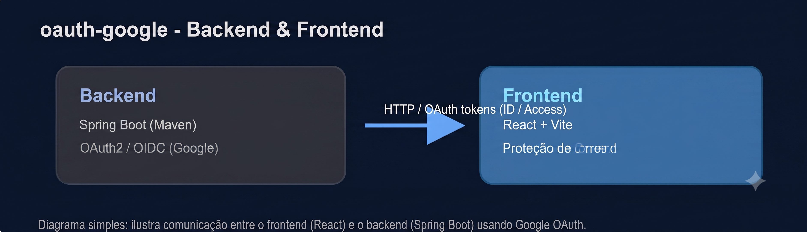

# OAuth Google

Repositório com dois projetos relacionados à autenticação via Google OAuth:

- oauth-google-backend — Backend Spring Boot que lida com OAuth2 / OIDC.
- oauth-google-frontend — Frontend em Vite + React que consome o backend e provê UI.



## Estrutura

- `oauth-google-backend/` — aplicação Spring Boot (Maven).
- `oauth-google-frontend/` — aplicação frontend com React

## Como rodar

Backend:

```cli
cd oauth-google-backend
.\mvnw.cmd spring-boot:run
```

Frontend:

```bash
cd oauth-google-frontend
npm install
npm run dev
```

Observações:
- Configure as credenciais do Google OAuth no arquivo `oauth-google-backend/src/main/resources/application.yaml` antes de rodar.
- O backend expõe endpoints protegidos; o frontend contém rota protegida usada para demonstrar login/autorização.

## Sobre

Projeto demonstrativo de integração entre um frontend em React (Vite) e um backend em Spring Boot usando autenticação via Google (OIDC). Ideal para referência rápida e aprendizado.
